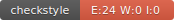

# Techniques de Test - M1 IA Alt

## Informations :

- **Nom** : Bouziane
- **Prénom** : Maryem
- **Groupe** : M1 IA Alt

## Badges :
- **CircleCI** :
  

- **Codecov** :
  

- **checkstyle** :
  
- **JavaDoc** :
  

## Implementations et documentation :

- vous pouvez consulter la Java DOC en cliquant sur le badge java doc ou par le lien suivant:
- https://bouzianemaryem.github.io/ceri-m1-techniques-de-test/

## Rapport TP6 :

- vous pouvez regarder le rapport du TP6 dans le lien suivant :
- [Voir le Rapport TP6](https://github.com/BouzianeMaryem/ceri-m1-techniques-de-test/blob/master/Rapport_TP6.pdf)

## technologies :
- **Maven** :
   
  Maven pour la gestion des dépendances. On utilise **pom.xml** pour cela.
***
- **CircleCI** :
   
  On utilise CircleCI pour vérifier que les tests marchent bien avec le reste du code. Il regarde si les tests passent et les valident, et dans notre cas, ils passent tous, donc on a le **badge** "**Passed**".
***
- **JUnit/Mockito** :
   
  Pour les tests unitaires, j'utilise JUnit et Mockito. JUnit sert à exécuter les tests, tandis que Mockito permet de simuler des parties du code pour faciliter les tests. Cela m'a aidé à **tester** des interfaces ou des classes précises avant les implementer.
***
- **Codecov** :
   
  Codecov est un outil qui mesure quelle partie de notre code est **testée** par nos tests automatiques, montrant un pourcentage de couverture. Notre implémentation a un **badge Codecov** à **100%**, indiquant que tout notre code et toutes les parties de l'implémentation sont **testées**. Pour Java, nous utilisons JaCoCo pour cette mesure.
***
- **Checkstyle** :
   
  Checkstyle vérifie notre code pour s'assurer qu'il respecte de bonnes pratiques de codage. Nous avons choisi **les règles de Google** pour vérifier la qualité de notre code. Après avoir corrigé les problèmes identifiés par Checkstyle, nous avons réussi à obtenir un **badge** montrant **0 erreur** Checkstyle.
***
- **JavaDoc** :
   
  JavaDoc génère automatiquement de la documentation pour notre code. En cliquant sur le **badge JavaDoc**, vous serez **redirigé vers le lien en ligne** de la documentation générée automatiquement pour notre implémentation.
